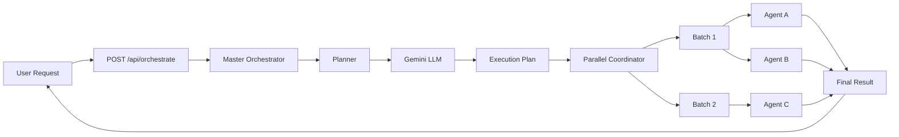
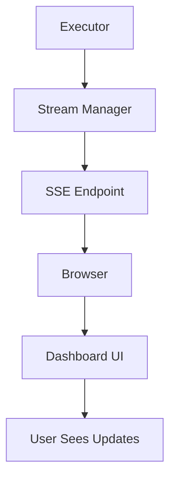

# 🏛️ ארכיטקטורת מנוע AI אוטונומי

## סקירה כללית

מערכת תזמור אוטונומית מתקדמת המורכבת מ-11 שכבות עם 52 רכיבים.

---

## 🎯 ארכיטקטורה לפי שכבות

### Layer 1: Core Orchestration
**תפקיד:** ניהול ביצוע ותכנון ברמה העליונה

```
┌─────────────────────────────────────┐
│     Master Orchestrator             │
│  ┌───────────┐    ┌──────────┐     │
│  │  Planner  │───▶│ Executor │     │
│  └───────────┘    └──────────┘     │
│         │              │            │
│         ▼              ▼            │
│    ┌─────────────────────┐         │
│    │   State Manager     │         │
│    └─────────────────────┘         │
└─────────────────────────────────────┘
```

**קבצים:**
- `master-orchestrator.ts` - Entry point, lifecycle management
- `planner.ts` - LLM-based planning
- `executor.ts` - Step execution engine
- `state-manager.ts` - State persistence + checkpoints

---

### Layer 2: Intelligence
**תפקיד:** גילוי, למידה, ואופטימיזציה

```
┌──────────────────────────────────────┐
│   Tool Discovery  ───▶ Agent Registry│
│         │                   │         │
│         ▼                   ▼         │
│   ┌──────────────────────────┐      │
│   │    Learning Engine        │      │
│   └──────────────────────────┘      │
│         │                             │
│         ▼                             │
│   ┌──────────────────────────┐      │
│   │    Smart Cache            │      │
│   └──────────────────────────┘      │
└──────────────────────────────────────┘
```

**קבצים:**
- `tool-discovery.ts` - Dynamic tool scanning
- `agent-registry.ts` - Agent capabilities + performance
- `learning/feedback-loop.ts` - Pattern learning
- `caching/smart-cache.ts` - Result caching

---

### Layer 3: Execution Engine
**תפקיד:** ביצוע מקבילי וטיפול בשגיאות

```
┌─────────────────────────────────────┐
│    Parallel Coordinator              │
│  ┌──────────────────────────┐       │
│  │  Dependency Analysis     │       │
│  │  [A,B,C,D] → [[A,C],[B,D]]      │
│  └──────────────────────────┘       │
│         │                            │
│         ▼                            │
│  ┌──────────────────────────┐       │
│  │    Error Recovery        │       │
│  │  Retry → Alternative → Ask│       │
│  └──────────────────────────┘       │
└─────────────────────────────────────┘
```

**קבצים:**
- `execution/parallel-coordinator.ts` - Parallel execution
- `execution/error-recovery.ts` - Error handling

---

### Layer 4: Communication
**תפקיד:** תקשורת בין רכיבים

```
┌─────────────────────────────────────┐
│      Shared Context Store            │
│    ┌─────────────────────┐          │
│    │  Key-Value Store     │          │
│    │  + Expiration        │          │
│    │  + Locks             │          │
│    └─────────────────────┘          │
│              │                       │
│              ▼                       │
│    ┌─────────────────────┐          │
│    │  Agent Messenger     │          │
│    │  Request/Response    │          │
│    │  Broadcast           │          │
│    └─────────────────────┘          │
└─────────────────────────────────────┘
```

**קבצים:**
- `shared-context.ts` - Shared memory
- `agent-messenger.ts` - Inter-agent messaging

---

### Layer 5: Real-time Streaming
**תפקיד:** עדכונים חיים ל-UI

```
┌─────────────────────────────────────┐
│        Stream Manager                │
│                                      │
│  Events:                            │
│  • progress    → UI updates         │
│  • log         → Live logs          │
│  • partial     → Incremental data   │
│  • complete    → Final result       │
│  • approval    → User action needed │
│                                      │
│  Protocol: Server-Sent Events (SSE) │
└─────────────────────────────────────┘
```

**קבצים:**
- `streaming/stream-manager.ts` - SSE management

---

### Layer 6: Safety & Control
**תפקיד:** בטיחות ובקרה

```
┌─────────────────────────────────────┐
│         HITL Gates                   │
│    Critical? → Approval Required     │
│         │                            │
│         ▼                            │
│    Conflict Resolver                 │
│    Resource Locks                    │
│         │                            │
│         ▼                            │
│    Rate Limiter                      │
│    API Quotas + Backoff              │
└─────────────────────────────────────┘
```

**קבצים:**
- `safety/hitl-gates.ts` - User approvals
- `safety/conflict-resolver.ts` - Lock management
- `safety/rate-limiter.ts` - API throttling

---

### Layer 7: Monitoring
**תפקיד:** ניטור וניתוח

```
┌─────────────────────────────────────┐
│    Distributed Tracer                │
│    Trace → Spans → Tree              │
│         │                            │
│         ▼                            │
│    Metrics Collector                 │
│    Duration, Tokens, Success         │
│         │                            │
│         ▼                            │
│    Log Aggregator                    │
│    Search, Tail, Export              │
└─────────────────────────────────────┘
```

**קבצים:**
- `monitoring/tracer.ts` - Distributed tracing
- `monitoring/metrics.ts` - Metrics collection
- `monitoring/log-aggregator.ts` - Log management

---

### Layer 8: Advanced Features
**תפקיד:** תכונות מתקדמות

```
┌─────────────────────────────────────┐
│    Webhooks                          │
│    Triggers → Actions                │
│         │                            │
│    Calendar Actions                  │
│    Find Slots → Schedule             │
└─────────────────────────────────────┘
```

**קבצים:**
- `webhooks/webhook-manager.ts` - Webhook management
- `actions/calendar-actions.ts` - Calendar operations

---

### Layer 9: Enterprise
**תפקיד:** תכונות ארגוניות

```
┌─────────────────────────────────────┐
│    Multi-tenancy                     │
│    Workspaces → RBAC → Permissions   │
│         │                            │
│    Plugin System                     │
│    Dynamic Loading → Hooks           │
│         │                            │
│    Plan Versioning                   │
│    Versions → Diff → A/B Test        │
└─────────────────────────────────────┘
```

**קבצים:**
- `auth/tenant-manager.ts` - Multi-tenancy
- `plugins/plugin-manager.ts` - Plugin system
- `versioning/plan-versioner.ts` - Version control

---

### Layer 10: Testing
**תפקיד:** בדיקות וסימולציות

```
┌─────────────────────────────────────┐
│    Execution Simulator               │
│    • Dry Run                         │
│    • Mock Agents                     │
│    • Chaos Testing                   │
│    • Regression Tests                │
│    • Load Testing                    │
└─────────────────────────────────────┘
```

**קבצים:**
- `testing/simulator.ts` - Testing framework

---

### Layer 11: API & UI
**תפקיד:** ממשקי משתמש ו-API

```
┌─────────────────────────────────────┐
│         API Routes (13)              │
│  /api/orchestrate/*                  │
│  /api/webhooks/*                     │
│         │                            │
│         ▼                            │
│    UI Dashboard (8 components)       │
│  ExecutionTree, LiveLogs, etc.       │
└─────────────────────────────────────┘
```

**קבצים:**
- 12 API route files
- 8 React components
- 1 React hook

---

## 🔄 Data Flow

### Request → Response Flow



### Real-time Updates Flow



---

## 💾 Database Schema Design

### Core Tables
```sql
executions (main execution records)
    ↓
execution_steps (individual steps)
    ↓
shared_context (shared data)
    ↓
agent_messages (inter-agent comm)
```

### Supporting Tables
```sql
execution_checkpoints (recovery points)
cache_entries (performance)
execution_feedback (learning)
learned_patterns (AI learning)
traces (observability)
logs (debugging)
pending_approvals (safety)
resource_locks (concurrency)
webhooks (automation)
workspaces (multi-tenancy)
plugins (extensibility)
```

---

## 🎨 Design Patterns

### 1. Singleton Pattern
כל manager הוא singleton:
```typescript
export const masterOrchestrator = new MasterOrchestrator();
```

### 2. Event Emitter Pattern
תקשורת אסינכרונית:
```typescript
agentMessenger.on('message', handleMessage);
```

### 3. Strategy Pattern
Error recovery strategies:
```typescript
switch (errorType) {
  case 'RATE_LIMIT': return 'RETRY';
  case 'TIMEOUT': return 'ALTERNATIVE';
}
```

### 4. Chain of Responsibility
Plugin hooks:
```typescript
context = await plugin1.handle(context);
context = await plugin2.handle(context);
```

### 5. Observer Pattern
Real-time streaming:
```typescript
stream.on('event', (event) => { /* update UI */ });
```

---

## 🔐 Security Considerations

### 1. Resource Locking
- Prevents race conditions
- Automatic expiration
- Transaction support

### 2. Rate Limiting
- Per-integration limits
- Exponential backoff
- Queue management

### 3. HITL Gates
- Critical action approval
- Impact estimation
- Reversibility check

### 4. Multi-tenancy
- Workspace isolation
- RBAC (Admin/Member/Viewer)
- Resource permissions

---

## 📈 Performance Optimizations

### 1. Parallel Execution
```typescript
// Instead of: 5 steps × 30s = 150s
// We get: [[2 steps], [1 step], [2 steps]] = 90s
```

### 2. Smart Caching
```typescript
// Same query? Use cache
if (cached = await cache.get(query)) return cached;
```

### 3. Checkpointing
```typescript
// Save state every 5s
setInterval(() => saveCheckpoint(), 5000);
```

### 4. Lazy Loading
```typescript
// Load tools on-demand
const tool = await toolDiscovery.getTool(id);
```

---

## 🧩 Extensibility Points

### 1. New Agents
הוסף קובץ ב-`src/execution/agents/*/new-agent.agent.ts`
→ Tool Discovery יזהה אוטומטית

### 2. New Integrations
הוסף connector ב-`src/integrations/connectors/new.connector.ts`
→ יזוהה אוטומטית

### 3. Plugins
```typescript
await pluginManager.install({
  id: 'my-plugin',
  type: 'MIDDLEWARE',
  hooks: [{ name: 'beforeStep', handler: myHandler }]
});
```

### 4. Webhooks
```typescript
await webhookManager.register(userId, 'My Webhook', trigger, action);
```

---

## 🎓 Best Practices

### Do's ✅
- השתמש ב-types בכל מקום
- לוג כל פעולה חשובה
- בדוק permissions לפני פעולה
- השתמש ב-cache כשאפשר
- אשר פעולות קריטיות

### Don'ts ❌
- אל תריץ steps חוסמים ב-UI thread
- אל תשכח לנקות locks
- אל תאחסן sensitive data ב-cache
- אל תדלג על error handling
- אל תשכח לסגור streams

---

## 📊 Monitoring Dashboard

### Key Metrics
- **Execution Count** - כמה executions רצים
- **Success Rate** - % הצלחה
- **Avg Duration** - זמן ממוצע
- **Token Usage** - שימוש ב-tokens
- **Cache Hit Rate** - אפקטיביות cache
- **Error Rate** - שיעור שגיאות

### Alerts
- Execution זמן רב (> 5 דקות)
- Success rate נמוך (< 70%)
- Error spike (> 10 errors/min)
- Memory high (> 80%)
- API rate limit approaching

---

## 🔧 Maintenance

### Daily
- בדוק system status
- סקור failed executions
- נקה expired cache

### Weekly
- נתח learned patterns
- סקור performance metrics
- עדכן prompts אם צריך

### Monthly
- Database cleanup
- Review A/B test results
- Update plugins
- Optimize slow agents

---

## 🚀 Deployment

### Development
```bash
npm run dev
```

### Production
```bash
npm run build:production
# Deploy web/.next folder
```

### Environment Variables
```bash
# Required
SUPABASE_URL
SUPABASE_SERVICE_KEY
GEMINI_API_KEY

# Optional
GOOGLE_DRIVE_FOLDER_ID
CLICKUP_WORKSPACE_ID
```

---

## 📚 Technical Stack

### Backend
- **Runtime:** Node.js 20+
- **Language:** TypeScript 5.7
- **Module System:** ESM (NodeNext)
- **Database:** Supabase (PostgreSQL)
- **LLM:** Google Gemini 3

### Frontend
- **Framework:** Next.js 15
- **Language:** TypeScript
- **Styling:** Tailwind CSS
- **Real-time:** SSE (Server-Sent Events)

### DevOps
- **Package Manager:** npm/pnpm
- **Build Tool:** tsc + Next.js
- **Testing:** Vitest
- **Linting:** ESLint

---

## 🎯 Design Philosophy

### 1. Modularity
כל רכיב עצמאי וניתן להחלפה

### 2. Type Safety
100% TypeScript, אפס `any`

### 3. Observability
כל פעולה logged, traced, metricked

### 4. Resilience
Error recovery בכל רובד

### 5. User Control
המשתמש תמיד בשליטה

### 6. Intelligence
המערכת לומדת ומשתפרת

---

המערכת תוכננה להיות **scalable, maintainable, ו-extensible**! 🏆
