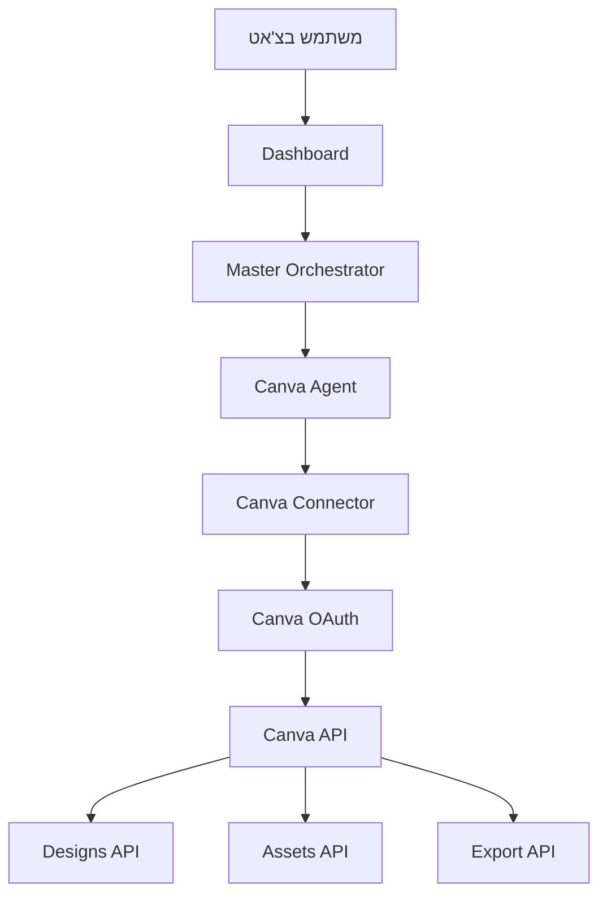

# 🎨 תכנית שילוב Canva Connect API

## סקירה

Canva Connect API מאפשר לנו:
- ✅ לשלוף דיזיינים וassets
- ✅ ליצור דיזיינים חדשים
- ✅ לייצא תכנים
- ✅ לנהל brand templates

## ארכיטקטורה



## שלב 1: הוספת Canva OAuth

### 1.1 עדכון Database Migration

```sql
-- Add Canva OAuth columns to users table
ALTER TABLE users ADD COLUMN IF NOT EXISTS canva_access_token TEXT;
ALTER TABLE users ADD COLUMN IF NOT EXISTS canva_refresh_token TEXT;
ALTER TABLE users ADD COLUMN IF NOT EXISTS canva_token_expires_at TIMESTAMPTZ;
ALTER TABLE users ADD COLUMN IF NOT EXISTS canva_user_id TEXT;
ALTER TABLE users ADD COLUMN IF NOT EXISTS canva_connected_at TIMESTAMPTZ;

CREATE INDEX IF NOT EXISTS idx_users_canva_user_id ON users(canva_user_id);
```

### 1.2 יצירת Canva OAuth Manager

קובץ: `src/integrations/auth/canva-oauth.ts`

```typescript
/**
 * Canva OAuth Manager
 * Handles OAuth 2.0 with PKCE flow
 */

const CANVA_SCOPES = [
  'design:meta:read',
  'design:content:read',
  'design:content:write',
  'asset:read',
  'asset:write',
  'brandtemplate:meta:read',
  'brandtemplate:content:read',
  'folder:read',
  'folder:write'
];

export async function initiateCanvaOAuthFlow(userId: string): Promise<string> {
  // Generate PKCE code_verifier and code_challenge
  const codeVerifier = generateCodeVerifier();
  const codeChallenge = await generateCodeChallenge(codeVerifier);
  
  // Save code_verifier to session/cache for later
  await saveCodeVerifier(userId, codeVerifier);
  
  const authUrl = new URL('https://www.canva.com/api/oauth/authorize');
  authUrl.searchParams.set('client_id', process.env.CANVA_CLIENT_ID);
  authUrl.searchParams.set('redirect_uri', process.env.CANVA_REDIRECT_URI);
  authUrl.searchParams.set('response_type', 'code');
  authUrl.searchParams.set('scope', CANVA_SCOPES.join(' '));
  authUrl.searchParams.set('code_challenge', codeChallenge);
  authUrl.searchParams.set('code_challenge_method', 'S256');
  authUrl.searchParams.set('state', userId);
  
  return authUrl.toString();
}
```

## שלב 2: יצירת Canva Connector

קובץ: `src/integrations/connectors/canva.connector.ts`

### 2.1 פונקציות עיקריות

```typescript
/**
 * Canva Connector
 * Interact with Canva Connect API
 */

export interface CanvaDesign {
  id: string;
  title: string;
  thumbnail: {
    url: string;
    width: number;
    height: number;
  };
  urls: {
    edit_url: string;
    view_url: string;
  };
  created_at: string;
  updated_at: string;
}

export interface CanvaAsset {
  id: string;
  name: string;
  type: 'IMAGE' | 'VIDEO';
  thumbnail: {
    url: string;
  };
  tags: string[];
  uploaded_at: string;
}

// List user's designs
export async function listDesigns(
  userId: string,
  options?: {
    search?: string;
    ownership?: 'any' | 'owned' | 'shared';
    sortBy?: 'relevance' | 'modified' | 'title';
    limit?: number;
  }
): Promise<CanvaDesign[]>;

// Get specific design
export async function getDesign(
  designId: string,
  userId: string
): Promise<CanvaDesign>;

// Create design from template
export async function createDesign(
  userId: string,
  options: {
    templateId?: string;
    title?: string;
    width?: number;
    height?: number;
  }
): Promise<CanvaDesign>;

// Export design
export async function exportDesign(
  designId: string,
  userId: string,
  format: 'PNG' | 'JPG' | 'PDF' | 'SVG'
): Promise<{
  url: string;
  expiresAt: Date;
}>;

// Upload asset
export async function uploadAsset(
  userId: string,
  options: {
    file?: Buffer;
    url?: string;
    name: string;
    tags?: string[];
  }
): Promise<CanvaAsset>;

// List assets
export async function listAssets(
  userId: string,
  options?: {
    tags?: string[];
    types?: ('IMAGE' | 'VIDEO')[];
  }
): Promise<CanvaAsset[]>;
```

## שלב 3: יצירת Canva Agent

קובץ: `src/execution/agents/canva.agent.ts`

```typescript
/**
 * Canva Agent
 * Handles Canva operations through natural language
 */

export class CanvaAgent {
  async execute(params: {
    userId: string;
    request: string;
    executionId: string;
  }): Promise<CanvaExecutionResult> {
    
    // Parse intent
    const intent = this.parseIntent(params.request);
    
    switch (intent.action) {
      case 'LIST_DESIGNS':
        return await this.listDesigns(params.userId, intent.filters);
        
      case 'CREATE_DESIGN':
        return await this.createDesign(params.userId, intent.specs);
        
      case 'EXPORT_DESIGN':
        return await this.exportDesign(params.userId, intent.designId);
        
      case 'UPLOAD_ASSET':
        return await this.uploadAsset(params.userId, intent.assetData);
        
      case 'SEARCH_DESIGNS':
        return await this.searchDesigns(params.userId, intent.query);
    }
  }
  
  private parseIntent(request: string) {
    // Use AI to parse the request
    // Examples:
    // "הראה לי את כל הדיזיינים שלי" → LIST_DESIGNS
    // "צור לי דיזיין חדש למותג X" → CREATE_DESIGN
    // "ייצא את הדיזיין הזה ל-PDF" → EXPORT_DESIGN
  }
}
```

## שלב 4: שילוב בOrchestrator

עדכון: `src/orchestration/planner.ts`

```typescript
{
  id: 'canva_agent',
  name: 'Canva Agent',
  description: 'Manage Canva designs and assets. Create, export, upload, search designs and brand materials. Supports: list designs, create from templates, export to PDF/PNG, upload assets, search by tags.'
}
```

## שלב 5: OAuth Endpoints

### 5.1 Initiate Flow
`web/app/api/auth/canva/route.ts`

```typescript
export async function GET(request: NextRequest) {
  const user = await getAuthUser(request);
  const authUrl = await initiateCanvaOAuthFlow(user.userId);
  return NextResponse.json({ authUrl });
}
```

### 5.2 Callback
`web/app/api/auth/canva/callback/route.ts`

```typescript
export async function GET(request: NextRequest) {
  const code = searchParams.get('code');
  const state = searchParams.get('state'); // userId
  
  // Exchange code for tokens (with PKCE)
  const tokens = await exchangeCodeForTokens(code, state);
  await saveCanvaTokens(state, tokens);
  
  return NextResponse.redirect('/dashboard?canva=connected');
}
```

### 5.3 Status
`web/app/api/auth/canva/status/route.ts`

```typescript
export async function GET(request: NextRequest) {
  const user = await getAuthUser(request);
  const status = await getCanvaConnectionStatus(user.userId);
  return NextResponse.json({ connected: status.connected });
}
```

## שלב 6: UI Integration

### 6.1 עדכון Dashboard

הוספה ל-`web/app/dashboard/page.tsx`:

```typescript
const [canvaConnected, setCanvaConnected] = useState(false);

useEffect(() => {
  // Check Canva status
  fetch('/api/auth/canva/status')
    .then(r => r.json())
    .then(data => setCanvaConnected(data.connected));
}, []);

// Add quick action
{
  icon: '🎨',
  title: 'צור דיזיין',
  prompt: 'צור לי דיזיין חדש ב-Canva',
  agentDomain: 'canva',
}
```

## דוגמאות שימוש

### דוגמה 1: חיפוש וייצוא

```
משתמש: "הראה לי את כל הדיזיינים של מותג סיקרט וייצא אותם ל-PDF"

מערכת:
1. Canva Agent → listDesigns(search: "סיקרט")
2. מוצא 5 דיזיינים
3. עבור כל דיזיין → exportDesign(format: "PDF")
4. שומר את כל ה-PDFs ב-Drive
5. מחזיר: "ייצאתי 5 דיזיינים ל-PDF ושמרתי ב-Drive"
```

### דוגמה 2: יצירת תוכן חדש

```
משתמש: "צור לי פוסט אינסטגרם למבצע של מיי שמן"

מערכת:
1. Canva Agent → createDesign(template: "instagram_post")
2. AI ממלא טקסט: "מבצע מיוחד של מיי שמן!"
3. מחזיר link לעריכה + thumbnail
4. "יצרתי פוסט ב-Canva, לחץ כאן לעריכה: [link]"
```

### דוגמה 3: העלאת assets

```
משתמש: "העלה את כל התמונות מהתיקייה של לקוח X ל-Canva"

מערכת:
1. Drive Agent → listFiles(folder: "לקוח X")
2. מוצא 20 תמונות
3. עבור כל תמונה:
   - Drive → downloadFile()
   - Canva → uploadAsset(tags: ["לקוח X"])
4. "העליתי 20 תמונות ל-Canva עם תג 'לקוח X'"
```

## Environment Variables נדרשים

```bash
# Canva OAuth
CANVA_CLIENT_ID=your_client_id
CANVA_CLIENT_SECRET=your_client_secret
CANVA_REDIRECT_URI=http://localhost:3000/api/auth/canva/callback

# For production
CANVA_REDIRECT_URI=https://yourdomain.com/api/auth/canva/callback
```

## Rate Limits & Best Practices

### Rate Limits
- 100 requests/minute per user
- 30 requests/minute for delete operations

### Best Practices
1. **Caching**: שמור metadata של designs במקומי
2. **Batch operations**: קבץ requests כמה שאפשר
3. **Error handling**: טפל ב-rate limits עם retry + exponential backoff
4. **Webhooks**: השתמש ב-webhooks לעדכונים real-time (אם זמין)

## סדר יישום מומלץ

1. ✅ **מיגרציה**: הוסף עמודות Canva ל-users table
2. ✅ **OAuth Manager**: יצור canva-oauth.ts
3. ✅ **Connector**: יצור canva.connector.ts עם הפונקציות הבסיסיות
4. ✅ **Agent**: יצור canva.agent.ts
5. ✅ **API Routes**: הוסף /api/auth/canva/*
6. ✅ **UI**: הוסף כפתור "התחבר ל-Canva" בדשבורד
7. ✅ **Testing**: בדוק כל flow
8. ✅ **Integration**: שלב ב-Orchestrator

## זמן משוער

- **Setup בסיסי**: 4-6 שעות
- **Agent מלא**: 8-10 שעות
- **בדיקות ותיקונים**: 4-6 שעות
- **סה"כ**: ~20 שעות

## תועלת עסקית

✨ **יכולות חדשות:**
- יצירה אוטומטית של חומרים שיווקיים
- ניהול מרכזי של brand assets
- ייצוא המוני של designs
- אינטגרציה מלאה בין Drive ↔ Canva

🚀 **Use Cases:**
- "צור לי 10 פוסטים לאינסטגרם עם הנתונים מהדוח"
- "העלה את כל הלוגואים שלנו ל-Canva"
- "ייצא את כל הדיזיינים של החודש הזה"
- "חפש דיזיינים שקשורים ללקוח X"

---

## התחלה מהירה

רוצה להתחיל? אני יכול ליצור את כל הרכיבים עכשיו! 🎨
