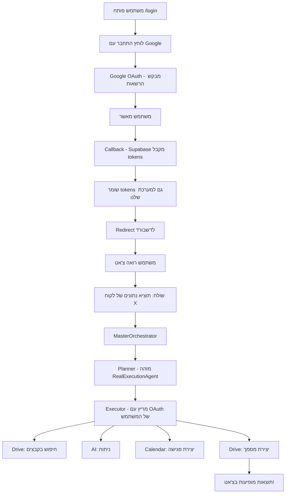

# ✅ שילוב OAuth - גרסה סופית ואינטואיטיבית!

## הבעיה שפתרנו

**לפני:** משתמש נכנס → צריך ללחוץ "התחבר ל-Google" → אז יכול להשתמש במערכת

**עכשיו:** משתמש נכנס → **הכל עובד אוטומטית!** 🎉

---

## איך זה עובד

### 1. התחברות ראשונית (Login)
```
משתמש → לוחץ "התחבר עם Google" → Google OAuth
```

**מה קורה:**
- Google מבקש הרשאות: Drive, Calendar, Gmail, Profile
- המשתמש מאשר
- Supabase שומר את הSession
- **החדש:** גם שומרים provider tokens למערכת!

### 2. Callback אוטומטי
```typescript
// web/app/auth/callback/page.tsx
if (session?.provider_token) {
  // שומר טוקנים למערכת שלנו
  await fetch('/api/auth/google/save-tokens', {
    userId: session.user.id,
    accessToken: session.provider_token,
    refreshToken: session.provider_refresh_token
  });
}
```

**תוצאה:** ✅ טוקנים נשמרים ב-DB אוטומטית!

### 3. דשבורד = Chat
```
משתמש → נכנס לדשבורד → רואה צ'אט → שולח בקשה → עובד!
```

**אין כפתורים נוספים, אין redirects, פשוט עובד!**

---

## מה שונה בקוד

### ✅ קבצים שהשתנו:

1. **`web/contexts/AuthContext.tsx`**
   - ✏️ הוספנו `drive` ו-`drive.file` ל-scopes
   - ✏️ שינוי מ-`drive.readonly` ל-Drive מלא

2. **`web/app/auth/callback/page.tsx`**
   - ✨ הוספנו שמירה אוטומטית של טוקנים
   - ✨ קריאה ל-API `save-tokens`

3. **`web/app/api/auth/google/save-tokens/route.ts`**
   - ✨ **קובץ חדש!** - שומר טוקנים ל-DB

### ✅ מה שכבר היה (לא נדרש שינוי):

- ✅ `src/execution/agents/real-execution.agent.ts` - כבר תומך ב-OAuth
- ✅ `src/integrations/connectors/drive.connector.ts` - כבר תומך ב-OAuth
- ✅ `src/orchestration/executor.ts` - כבר משתמש ב-Agent
- ✅ `web/app/dashboard/page.tsx` - כבר צ'אט מלא!

---

## הזרימה המלאה



---

## איך להריץ

### 1. וודא שיש לך את כל ה-env vars:

```bash
# Google OAuth (Supabase)
NEXT_PUBLIC_SUPABASE_URL=...
NEXT_PUBLIC_SUPABASE_ANON_KEY=...
SUPABASE_SERVICE_ROLE_KEY=...

# Google APIs
GOOGLE_CLIENT_ID=...
GOOGLE_CLIENT_SECRET=...
GEMINI_API_KEY=...
```

### 2. הרץ את השרת:

```bash
cd web
pnpm dev
```

### 3. פתח בדפדפן:

```
http://localhost:3000
```

### 4. התחבר:

- לחץ "התחבר עם Google"
- אשר הרשאות
- **זהו! המערכת מוכנה!**

### 5. השתמש:

פשוט כתוב בקשה בצ'אט:

```
תוציא לי נתונים של מיי שמן מדצמבר ותקבע פגישה
```

**המערכת תבצע:**
1. חיפוש בDrive שלך
2. קריאת קבצים
3. ניתוח AI
4. יצירת פגישה ב-Calendar
5. יצירת אג'נדה ב-Drive

**הכל אוטומטי!** ✨

---

## תיקון בעיות

### "No access token" בלוגים

**סיבה:** לא התחברת עדיין או הטוקנים לא נשמרו

**פתרון:**
1. התנתק (`Sign Out`)
2. התחבר שוב
3. וודא שאישרת את כל ההרשאות

### "OAuth not connected"

**סיבה:** provider_token לא נשמר ב-callback

**פתרון:** 
```bash
# בדוק בDB:
SELECT google_access_token FROM users WHERE id = 'user-id';

# אם NULL - התחבר מחדש
```

### "Cannot read from Drive"

**סיבה:** הרשאות Drive חסרות

**פתרון:**
1. בדוק ש-`drive` ו-`drive.file` בscopes
2. התחבר מחדש לקבלת הרשאות חדשות

---

## סיכום

### ❌ לפני:
1. Login → Supabase
2. Dashboard → כפתור "התחבר ל-Google"
3. OAuth נפרד
4. אז אפשר לשלוח בקשות

### ✅ עכשיו:
1. Login → **הכל נעשה יחד!**
2. Dashboard → **Chat מוכן מיד!**
3. שלח בקשה → **עובד!**

---

## הצעדים הבאים (אופציונלי)

1. **Refresh Token Logic:**
   - כבר יש ב-`google-oauth.ts`
   - פשוט לוודא שעובד

2. **Error Handling:**
   - להוסיף Toast/Alert אם OAuth נכשל
   - להציע reconnect

3. **Monitoring:**
   - לוג כמה פעמים משתמשים חוזרים
   - לבדוק token expiry

---

## זהו! 🎊

**המערכת עכשיו אינטואיטיבית לחלוטין:**
- כניסה אחת ✅
- דשבורד פשוט ✅  
- צ'אט שעובד ✅
- אוטומציה מלאה ✅

**פשוט תכנס ותשתמש!** 🚀
